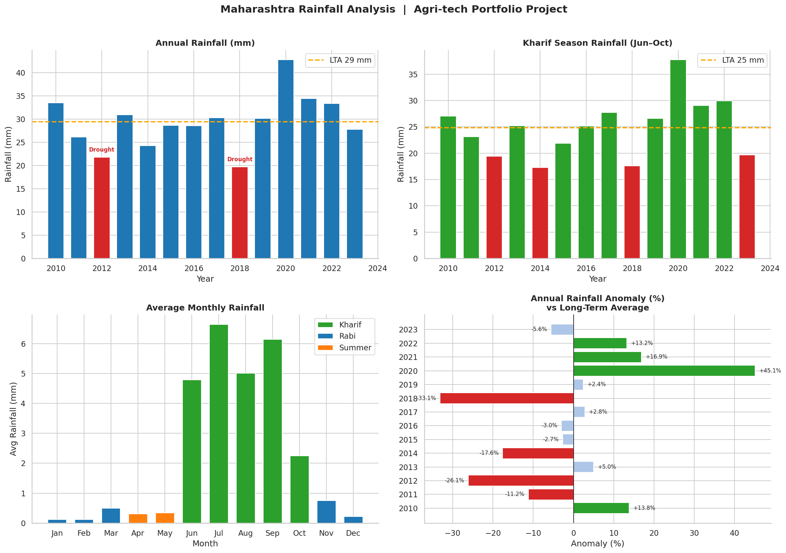

# Agri-tech Climate Portfolio
### By Priyanka Barde  | Engineering Professor & Agri-tech Data Analyst | Pune, Maharashtra

---

## Project 1 — Maharashtra Rainfall Analysis (2010–2023)

A data analysis of 13 years of monsoon patterns in Maharashtra using 
Python and NASA's free POWER satellite API.

### Key Findings
- 2018 was the worst drought year — 33% below long-term average
- 2020 was the best monsoon in 13 years — 45% above average
- July is the single most critical month for kharif crops
- 2023 ended slightly below normal (−5.6%) — a watch signal

### Why it matters
Soybean, cotton and jowar in Maharashtra depend on 5 months of monsoon.
This analysis supports crop insurance risk modelling, sowing advisories,
and district-level drought classification.

### Tools used
Python · pandas · matplotlib · seaborn · NASA POWER API (free)

### Output

---
## About me
I am an Assistant Professor in Mechanical/Civil Engineering with 8 years
of teaching and student mentoring experience. I am building a portfolio
in agri-tech climate data analysis — connecting weather patterns to
farming decisions for startups, NGOs, and insurance companies.

📍 Pune, Maharashtra
📧 pbardejayale@gmail.com
🔗 https://www.linkedin.com/in/priyanka-barde-00250797

---
*More projects coming: Sowing Date Advisor · District Drought Risk Map · Crop Yield Forecast*
